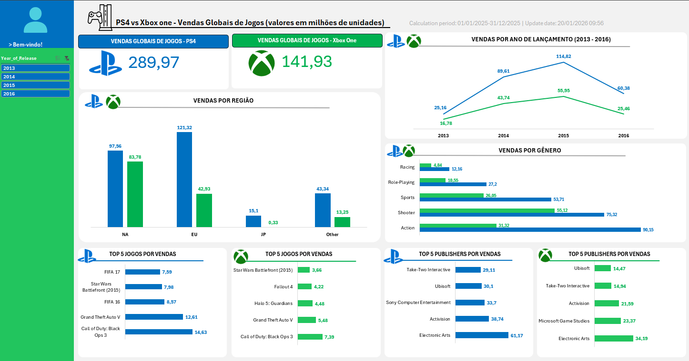

# PS4 vs Xbox One - Global Game Sales Dashboard

Dashboard analítico desenvolvido no Microsoft Excel para comparar o desempenho global de vendas entre as plataformas PlayStation 4 e Xbox One, apoiando análises de mercado por meio de dados históricos de vendas de jogos.

**Status**: Concluído

**Tipo de projeto**: Dashboard Analítico

**Base de dados**: Video Game Sales Dataset (Kaggle)

**Segmento**: Mercado de Games

**Ferramenta principal**: Microsoft Excel

**Objetivo**: Comparar o desempenho comercial entre PlayStation 4 e Xbox One utilizando dados históricos de vendas globais.

---

## Dashboard



---

## Sobre o projeto

O mercado de jogos eletrônicos apresenta diferenças significativas entre plataformas, regiões, gêneros e publishers. Compreender esses padrões é essencial para apoiar decisões relacionadas à distribuição, posicionamento de produtos e identificação de oportunidades de mercado.

Neste projeto foi desenvolvido um dashboard analítico no Microsoft Excel com o objetivo de comparar o desempenho comercial das plataformas PlayStation 4 e Xbox One por meio da análise de dados históricos de vendas globais de jogos.

---

## Contexto de negócio

Empresas do setor de games utilizam dados de vendas para compreender o comportamento do mercado, identificar tendências de consumo e avaliar o desempenho de diferentes plataformas.

Nesse contexto, comparar os resultados entre PlayStation 4 e Xbox One permite identificar diferenças regionais, gêneros de maior sucesso, publishers com melhor desempenho e títulos que concentraram maior volume de vendas durante o período analisado.

---

## Objetivo

Desenvolver um dashboard analítico que permita:

- comparar o desempenho comercial entre PlayStation 4 e Xbox One;
- analisar vendas por região;
- acompanhar a evolução das vendas ao longo do tempo;
- identificar os gêneros com maior volume de vendas;
- analisar os publishers mais relevantes de cada plataforma;
- identificar os jogos com melhor desempenho comercial.

---

## Capacidades analíticas

- Comparação entre plataformas
- Comparação de vendas por região
- Evolução temporal das vendas
- Comparação por gênero
- Ranking dos jogos mais vendidos
- Ranking dos principais publishers
- Segmentação dinâmica por ano de lançamento

---

## Indicadores monitorados

- Vendas Globais — PlayStation 4
- Vendas Globais — Xbox One

---

## Principais análises

- Comparação das vendas globais entre PlayStation 4 e Xbox One
- Distribuição das vendas por região
- Evolução das vendas por ano de lançamento (2013–2016)
- Comparação das vendas por gênero
- Ranking dos cinco jogos mais vendidos por plataforma
- Ranking dos cinco principais publishers por plataforma

---

## Principais insights

- O **PlayStation 4** apresentou maior volume de vendas globais em comparação ao **Xbox One**, indicando melhor desempenho comercial no período analisado.

- As regiões **América do Norte** e **Europa** concentraram a maior parte das vendas em ambas as plataformas, destacando-se como os principais mercados consumidores.

- Os gêneros **Action** e **Shooter** representaram o maior volume de vendas, evidenciando a preferência do mercado por esses segmentos durante o período analisado.

- O ano de **2015** concentrou o maior volume de vendas entre os jogos lançados, seguido por redução em 2016.

- Os rankings demonstraram diferenças entre os principais jogos e publishers de cada plataforma, indicando perfis comerciais distintos entre PlayStation 4 e Xbox One.

---

## Tecnologias utilizadas

- Microsoft Excel
- Tabelas Dinâmicas
- Gráficos Dinâmicos
- Segmentação de Dados
- Dashboard Interativo

---

## Estrutura do projeto

```text
.
├── assets/
│   └── dashboard.png
├── dashboard/
│   └── PS4_vs_Xbox_Dashboard.xlsx
├── data/
│   └── videogame-sales-dataset.xlsx
├── README.md
└── LICENSE
```

---

## Como visualizar

Para explorar o dashboard, basta abrir o arquivo `dashboard/PS4_vs_Xbox_Dashboard.xlsx` utilizando o Microsoft Excel.

---

## Autor

**Paulo Ricardo Costa Mariano de Souza**

- GitHub: https://github.com/PauloData9
- LinkedIn: https://www.linkedin.com/in/paulo-ricardo-costa-mariano-de-souza-834585376
